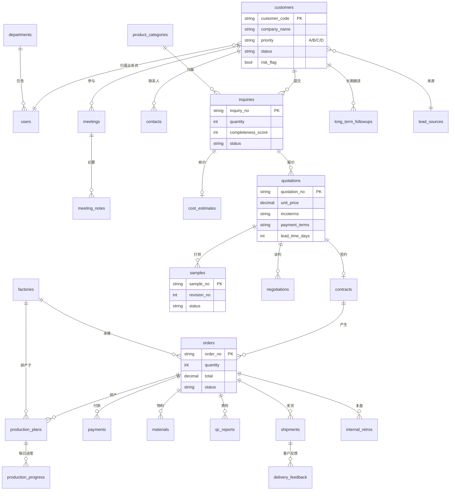
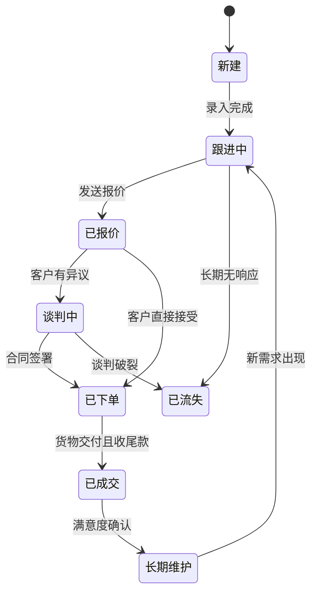
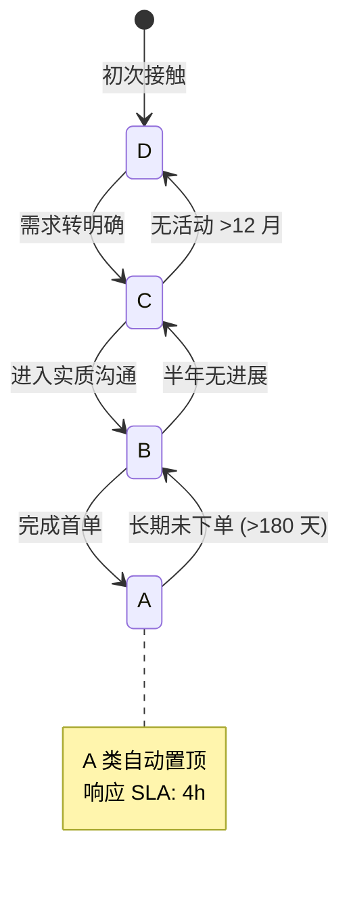
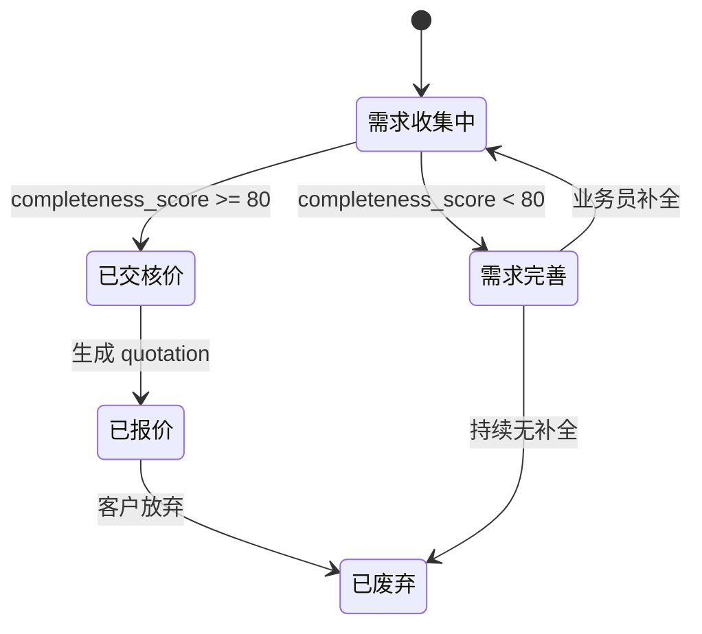
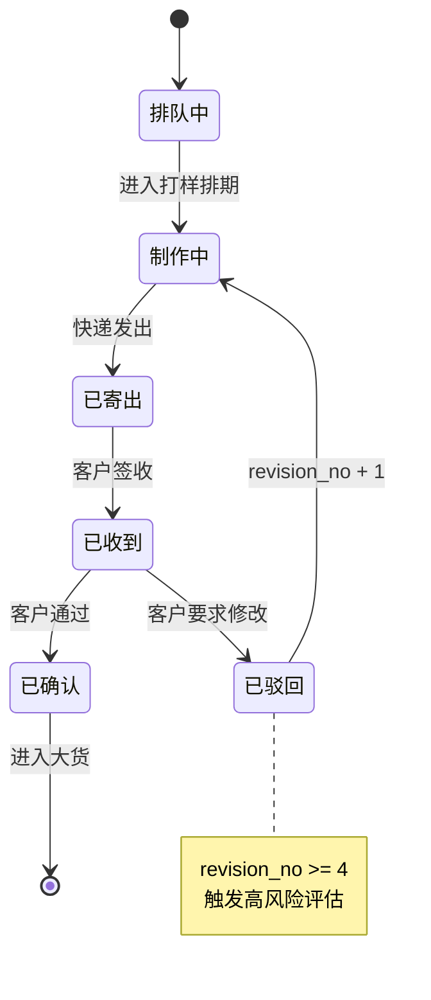
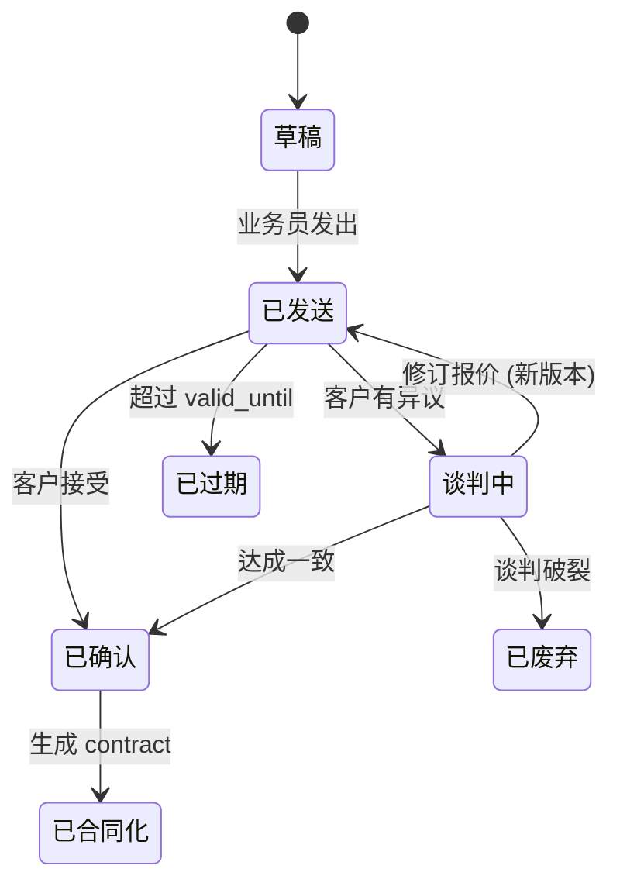
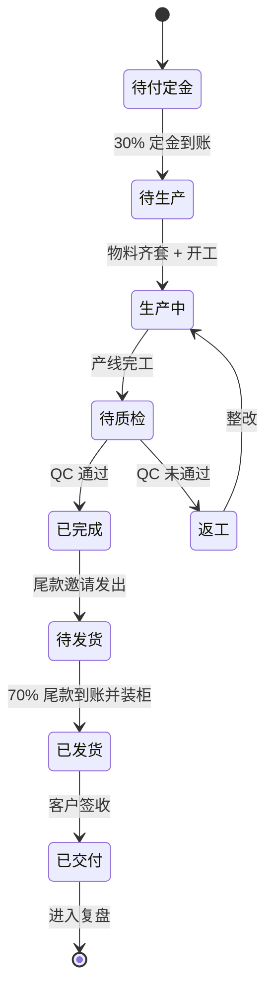
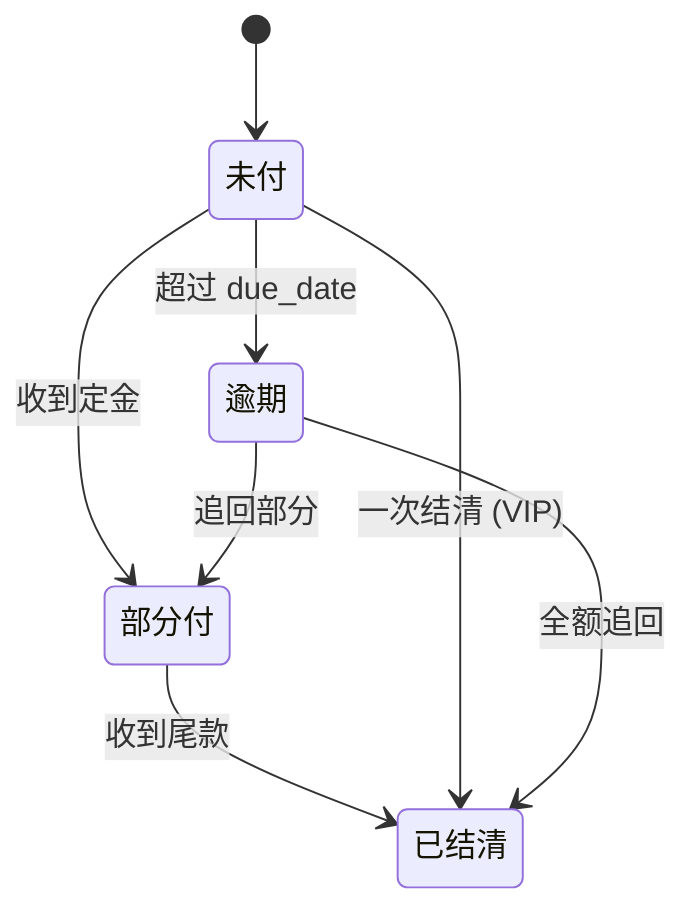
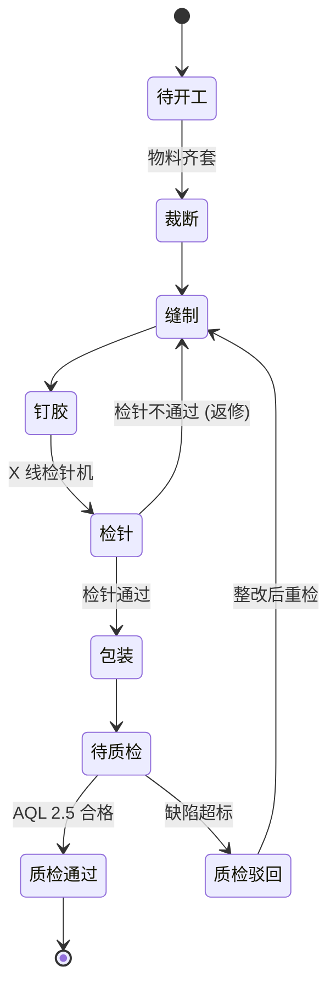
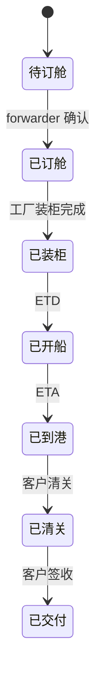

# NocoCRM 开发任务清单 (tasks.md)

> 本文档是 NocoCRM 的施工蓝图。每条任务"翻开就能做"。
> 配合 `CLAUDE.md`（项目总指南）和根目录 6 份业务知识库 `01-06.md` 一起使用。

---

## 0. 文档使用指引

### 0.1 任务编号规则

- **里程碑**：`M0` ~ `M17`（按 SOP 13 阶段 + 全局横向）
- **任务 ID**：`T{里程碑序号}.{两位序号}`，例如 `T2.03` = M2 的第 3 个任务
- 编号一旦确定不再变动，方便跨文档引用

### 0.2 优先级图例

| 标记 | 含义 | 说明 |
|------|------|------|
| `P0` | 核心阻塞 | 不完成无法进入下一里程碑 |
| `P1` | 重要 | 影响业务效率，但不阻塞主链路 |
| `P2` | 优化 | 锦上添花，可上线后补 |

### 0.3 类型标签

| 标签 | 含义 |
|------|------|
| `[Setup]` | 安装、配置、插件启用 |
| `[Collection]` | 新建数据表 |
| `[Field]` | 字段配置或单选字典 |
| `[View]` | 视图、看板、报表 |
| `[Workflow]` | 工作流编排 |
| `[ACL]` | 权限角色配置 |
| `[Template]` | 邮件/PDF/话术模板 |
| `[Test]` | 端到端或权限矩阵测试 |
| `[Doc]` | 文档、培训物料 |

### 0.4 任务卡格式

```
### T{x.yy} {任务名} [类型] {优先级}
- 目标：一句话
- 依赖：T{a.bb}, T{c.dd}
- NocoBase 路径：UI 导航
- 字段表 / 配置详情
- 工作流逻辑（若有）
- ACL 规则（若有）
- 验收标准：勾选项 checklist
- 关联知识库：引用 01-06 哪一段
- 备注
```

### 0.5 命名约束（强制）

- **Collection / Field key**：小写 snake_case 英文，例如 `customers`、`pp_sample_date`
- **显示名 / 菜单 / 选项 label**：中文
- **状态字段**：单选 + 中文 label
- **金额字段**：number 类型 + 保留 2 位 + 关联 `currencies_dict`

---

## 1. ER 关系总览图



---

## 2. 状态机总览

### 2.1 客户主状态



### 2.2 客户分级流转 (A/B/C/D)



### 2.3 询盘状态



### 2.4 样品状态



### 2.5 报价状态



### 2.6 订单状态



### 2.7 付款状态



### 2.8 生产状态



### 2.9 发货状态



---

# M0 — 环境准备

> 目标：从空机器到可访问的 NocoBase 实例，并启用全部所需插件。

### T0.01 NocoBase 本地安装 [Setup] P0

- **目标**：本地跑起 NocoBase，能登入后台。
- **依赖**：无
- **NocoBase 路径**：终端命令
- **操作步骤**：
  1. 进入 `project/` 目录
  2. `yarn install`
  3. 复制 `.env.example` 为 `.env`，填入 `APP_KEY`（强随机串）
  4. `yarn nocobase install`（初始化数据库 schema）
  5. `yarn dev` 启动开发服务器
  6. 浏览器打开 `http://localhost:13000`，按引导创建 admin 账号
- **验收标准**：
  - [ ] 浏览器能打开 `http://localhost:13000`
  - [ ] 用 admin 账号登入，能看到默认后台
  - [ ] 终端无报错
- **关联知识库**：无
- **备注**：Node ≥ 18；macOS Apple Silicon 需 Rosetta 跑某些原生模块

### T0.02 数据库初始化 [Setup] P0

- **目标**：用 PostgreSQL 作为生产级数据库。
- **依赖**：T0.01
- **NocoBase 路径**：`.env` 文件 + psql
- **操作步骤**：
  1. 安装 PostgreSQL 14+（或 Docker `postgres:14`）
  2. `createuser nocobase -P`、`createdb nocobase -O nocobase`
  3. `.env` 设置：
     ```
     DB_DIALECT=postgres
     DB_HOST=127.0.0.1
     DB_PORT=5432
     DB_DATABASE=nocobase
     DB_USER=nocobase
     DB_PASSWORD=xxx
     DB_TABLE_PREFIX=
     ```
  4. 重启 `yarn dev`，等待自动迁移
- **验收标准**：
  - [ ] `psql -d nocobase -c "\dt"` 能看到 NocoBase 系统表
  - [ ] 后台创建测试数据，psql 里能查到
- **关联知识库**：无
- **备注**：开发可以用 SQLite（默认），但与生产不一致；建议本地就上 PostgreSQL

### T0.03 启用核心插件 [Setup] P0

- **目标**：一次性启用所有 NocoCRM 需要的插件。
- **依赖**：T0.01
- **NocoBase 路径**：右上角头像 → 插件管理
- **启用清单**（来自 CLAUDE.md）：
  - 数据：`data-source-main`、`collection-tree`、`snapshot-field`、`field-formula`、`field-sequence`、`field-sort`
  - 视图：`kanban`、`calendar`、`gantt`、`block-grid-card`、`block-list`、`block-markdown`
  - 工作流：`workflow`、`workflow-action-trigger`、`workflow-delay`、`workflow-loop`、`workflow-mailer`、`workflow-notification`、`workflow-manual`、`workflow-parallel`
  - 通知：`notification-email`、`notification-in-app-message`、`notification-manager`
  - 文件：`file-manager`、`file-previewer-office`、`field-attachment-url`
  - 报表：`charts`、`data-visualization`、`data-visualization-echarts`
  - 安全：`acl`、`auth`、`audit-logs`、`api-keys`
  - 协作：`comments`、`departments`
  - 运维：`backup-restore`、`error-handler`、`logger`、`localization`
  - 模拟：`mock-collections`（仅开发环境）
- **验收标准**：
  - [ ] 上述每个插件状态为"已启用"
  - [ ] 重启后无报错
- **关联知识库**：无
- **备注**：启用顺序不重要，但启用 workflow 后再启用 workflow-* 子插件

### T0.04 邮件 / 文件 / 备份配置 [Setup] P1

- **目标**：保证通知、附件、备份三件套能用。
- **依赖**：T0.03
- **配置项**：
  - SMTP：`.env` 增加 `SMTP_HOST/PORT/USER/PASS/FROM`
  - 在"通知管理 → 邮件通道"创建默认通道并测试
  - 文件存储：本地 `storage/uploads`（默认）或 S3 兼容
  - 备份：`backup-restore` 插件设定每日 02:00 自动备份到 `storage/backups`
- **验收标准**：
  - [ ] 给自己发一封测试邮件能收到
  - [ ] 上传一张图片到任意 collection，预览正常
  - [ ] 手动触发一次备份成功生成 `.dump` 文件
- **关联知识库**：无
- **备注**：腾讯企业邮 SMTP `smtp.exmail.qq.com:465` SSL；Gmail 需 App Password

---

# M1 — 基础数据架构

> 目标：建立所有业务表共用的"基础设施层"。

### T1.01 部门表 departments [Collection] P0

- **目标**：组织架构。
- **依赖**：T0.03（启用 departments 插件）
- **NocoBase 路径**：数据源管理 → main → 创建数据表
- **字段表**：

| 字段 key | 类型 | 显示名 | 选项 / 校验 | 必填 | 默认 |
|----------|------|--------|--------------|------|------|
| id | bigInt PK | ID | 自增 | - | - |
| name | string | 部门名 | 唯一 | 是 | - |
| parent_id | belongsTo(departments) | 上级部门 | - | 否 | - |
| manager_id | belongsTo(users) | 部门主管 | - | 否 | - |
| description | text | 描述 | - | 否 | - |
| created_at | createdAt | 创建时间 | - | - | now |
| updated_at | updatedAt | 更新时间 | - | - | - |

- **预置数据**：销售部 / 业务部（含国内、海外子部） / 财务部 / 山东工厂 / 缅甸工厂 / 质检部 / 采购部 / IT
- **验收标准**：
  - [ ] 数据表可见
  - [ ] 能形成两级树
  - [ ] 8 个部门预置完毕
- **关联知识库**：`01-公司概况`、`02-工厂硬件`
- **备注**：分配 owner 字段时会用到

### T1.02 扩展 users 表 [Collection] P0

- **目标**：业务员、工厂人员区分清楚。
- **依赖**：T1.01
- **NocoBase 路径**：用户管理 → 字段
- **新增字段**：

| 字段 key | 类型 | 显示名 | 选项 |
|----------|------|--------|------|
| department_id | belongsTo(departments) | 所属部门 | - |
| employee_no | string | 工号 | 唯一 |
| phone | string | 电话 | - |
| region | radio | 地区 | 中国 / 缅甸 / 其他 |
| job_title | string | 职位 | - |
| is_active | boolean | 在职 | 默认 true |

- **验收标准**：
  - [ ] 新增字段在用户列表/详情可见
  - [ ] 创建 3 个测试账号（admin / sales01 / qc01）
- **关联知识库**：无
- **备注**：NocoBase 自带 username/email/password 不动

### T1.03 工厂表 factories [Collection] P0

- **目标**：双工厂路由的基础。
- **依赖**：T0.03
- **字段表**：

| 字段 key | 类型 | 显示名 | 选项 / 校验 | 默认 |
|----------|------|--------|--------------|------|
| code | string | 工厂代码 | 唯一，正则 `^[A-Z]{2}_[A-Z]{2,3}$` | - |
| name | string | 工厂名 | - | - |
| country | radio | 国家 | 中国 / 缅甸 | - |
| address | string | 地址 | - | - |
| capacity_monthly_pcs | integer | 月产能（件） | ≥ 0 | - |
| sewing_workers | integer | 缝纫工人数 | - | - |
| flat_machines | integer | 平车数 | - | - |
| computer_machines | integer | 电脑车数 | - | - |
| equipment | json | 全部设备明细 | - | - |
| contact_person | belongsTo(users) | 联系人 | - | - |
| is_sampling_center | boolean | 是否打样中心 | - | false |

- **预置数据**（来自 02 知识库）：
  - `CN_RZ` 日照主厂：8000㎡、缝纫 100、平车 120、电脑车 22；is_sampling_center=false
  - `CN_QD` 青岛打样中心：is_sampling_center=true
  - `MM_YGN` 缅甸仰光 (NGWE PIN LAI)：缝纫 370、平车 420、电脑车 48、高车 60、双针车 12、裁断 10、打钉 10、X 线检针 2
- **验收标准**：
  - [ ] 3 条预置数据可见
  - [ ] 工厂代码唯一性校验生效
- **关联知识库**：`02-工厂硬件`
- **备注**：后续 orders.production_factory 引用本表

### T1.04 产品分类 product_categories [Collection] P0

- **依赖**：T1.03
- **字段表**：

| 字段 key | 类型 | 显示名 | 选项 / 默认 |
|----------|------|--------|--------------|
| name | string | 分类名 | - |
| name_en | string | 英文名 | - |
| name_ja | string | 日文名 | - |
| default_factory | belongsTo(factories) | 默认工厂 | - |
| default_moq | integer | 默认 MOQ | 缅甸路由默认 1500 |

- **预置数据**：背包 / 都市通勤包 / 休闲包 / 学生包 / 布包 / 其他
- **验收标准**：[ ] 6 条预置数据
- **关联知识库**：`03-产品线`

### T1.05 字典表 regions_dict / currencies_dict [Collection] P0

- **依赖**：T0.03
- **regions_dict**：code (ISO 3166)、name_zh、name_en、phone_code
  - 预置：日本/中国/美国/德国/法国/英国/韩国/越南/泰国/缅甸 等 30+
- **currencies_dict**：code（ISO 4217）、symbol、name
  - 预置：USD `$` / CNY `¥` / JPY `¥` / EUR `€` / GBP `£`
- **验收标准**：[ ] 两表有预置数据且能在他表 belongsTo

### T1.06 首页 Dashboard [View] P1

- **目标**：进后台看到关键指标。
- **依赖**：T1.01-T1.05
- **指标**：本月新增客户、A 类客户数、在途订单数、本月发货量、未付尾款金额
- **块类型**：`block-grid-card` + `data-visualization-echarts`
- **验收标准**：[ ] 登录后默认看到此页 [ ] 数字会随数据变化

---

# M2 — 阶段 1 客户获取与分类

### T2.01 来源字典 lead_sources [Collection] P0

- **依赖**：T0.03
- **字段**：name (单选项实现也可)、is_active、icon
- **预置**：网站表单 / ChatBot / 邮件 / WhatsApp / 微信 / 展会 / 朋友介绍 / 海关数据 / Google 广告 / LinkedIn / 其他
- **验收标准**：[ ] 11 条预置数据

### T2.02 客户主表 customers [Collection] P0

- **依赖**：T1.01-T1.05、T2.01
- **字段表**（完整）：

| 字段 key | 类型 | 显示名 | 选项 / 校验 | 必填 | 默认 |
|----------|------|--------|--------------|------|------|
| customer_code | string | 客户编号 | 自动 `CUST-yyyymm-xxx`（field-sequence） | - | auto |
| company_name | string | 公司名 | unique 提示 | 是 | - |
| company_name_en | string | 英文公司名 | - | 否 | - |
| country | belongsTo(regions_dict) | 国家 | - | 是 | - |
| city | string | 城市 | - | 否 | - |
| industry | radio | 行业 | 品牌商 / 贸易商 / 零售 / 设计公司 / 其他 | 否 | - |
| website | string | 网站 | URL | 否 | - |
| primary_contact | string | 主要联系人 | - | 是 | - |
| phone | string | 电话 | - | 否 | - |
| email | string | 邮箱 | email | 是 | - |
| wechat | string | 微信 | - | 否 | - |
| whatsapp | string | WhatsApp | - | 否 | - |
| priority | radio | 客户等级 | A / B / C / D（颜色见 T2.04） | 是 | D |
| status | radio | 客户状态 | 新建 / 跟进中 / 已报价 / 谈判中 / 已下单 / 已成交 / 长期维护 / 已流失 | 是 | 新建 |
| risk_flag | boolean | 高风险 | - | - | false |
| source | belongsTo(lead_sources) | 来源 | - | 是 | - |
| annual_volume_estimate | integer | 预估年单量（件） | - | 否 | - |
| target_categories | hasMany(product_categories) | 目标品类 | - | 否 | - |
| preferred_factory | belongsTo(factories) | 偏好工厂 | - | 否 | - |
| owner | belongsTo(users) | 业务员 | - | 是 | currentUser |
| first_contact_at | datetime | 首次接触时间 | - | - | now |
| last_contact_at | datetime | 最近联系时间 | - | - | - |
| first_meeting_at | datetime | 首次会议时间 | - | - | - |
| first_meeting_outcome | radio | 首次会议结果 | 积极 / 中性 / 消极 | - | - |
| tenant_id | belongsTo(factories) | 主负责工厂 | - | - | - |
| notes | text | 备注 | - | - | - |
| created_at | createdAt | - | - | - | - |
| updated_at | updatedAt | - | - | - | - |
| created_by | createdBy | - | - | - | - |
| updated_by | updatedBy | - | - | - | - |

- **验收标准**：[ ] 全部字段存在 [ ] 创建一条记录全字段可填可显示
- **关联知识库**：`SOP 阶段 1`
- **备注**：customer_code 用 `field-sequence` 插件实现

### T2.03 联系人表 contacts [Collection] P1

- **依赖**：T2.02
- **字段**：
  - customer_id (belongsTo customers)、name、position、phone、email、wechat
  - is_primary (boolean)
  - decision_role (radio: 决策人 / 采购 / 技术 / 财务 / 助理 / 其他)
- **验收标准**：[ ] 一个 customer 能挂 3 个 contact [ ] 主联系人唯一性校验

### T2.04 priority 颜色映射 [Field] P0

- **依赖**：T2.02
- **配置**：customers.priority 单选项设置：
  - A → 颜色 `#2e7d32` (绿) + 排序权重 1
  - B → `#ef6c00` (橙) + 权重 2
  - C → `#7b1fa2` (紫) + 权重 3
  - D → `#546e7a` (灰) + 权重 4
- **看板视图**：列表/看板按 priority 排序，A 自动置顶
- **验收标准**：[ ] 列表中等级以彩色 tag 显示 [ ] A 类自动置顶

### T2.05 询盘接入与首响应工作流 [Workflow] P0

- **目标**：表单/邮件接入后，工作时间内 4h 内创建跟进任务；非工作时间自动回复 + 次日补跟。
- **依赖**：T2.02
- **触发**：customers 表创建后 (afterCreate)
- **节点**：
  1. 判断当前时间是否在工作日 9:00-18:00（北京时间）
  2. 工作时间：
     - 创建跟进任务（assignee = customer.owner，due = now + 4h，title = "首响应：{company_name}"）
     - 站内信通知 owner
  3. 非工作时间：
     - 调用 notification-email 发送自动回复模板 T2.09（按客户首选语言）
     - 延时到次日 9:30 创建跟进任务
- **验收标准**：
  - [ ] 工作时间创建客户 → 4h 待办出现
  - [ ] 非工作时间创建客户 → 立即收到自动回复 + 次日 9:30 待办
- **关联知识库**：`SOP 阶段 1` 工作时间响应

### T2.06 初始客户分级自动建议 [Workflow] P0

- **触发**：customers afterCreate
- **逻辑**：
  ```
  IF source ∈ {老客户转介, 海关数据深度匹配} → 建议 priority = B
  ELSE IF annual_volume_estimate >= 50000 AND 需求明确 → 建议 B
  ELSE IF annual_volume_estimate >= 5000 → 建议 C
  ELSE → 建议 D
  IF 业务员已与该客户有 3 次以上深度沟通 → 建议升 B
  ```
- **节点**：用 workflow-javascript 计算后写入 priority；同时在 notes 写入分级理由
- **验收标准**：[ ] 创建 10 个客户自动分级正确率 ≥ 80%
- **关联知识库**：`SOP 阶段 1 A/B/C/D 标准`

### T2.07 客户视图集 [View] P0

- **依赖**：T2.02、T2.04
- **创建 4 个表格视图**：
  1. 全部客户（默认按 priority 升序）
  2. A 类专属（filter: priority = A）
  3. 我的客户（filter: owner = currentUser）
  4. 高风险（filter: risk_flag = true）
- **验收标准**：[ ] 4 个视图均可一键切换 [ ] 筛选条件正确

### T2.08 客户 Kanban 看板 [View] P0

- **依赖**：T2.07
- **配置**：plugin-kanban，按 status 分列（8 列），卡片显示：company_name / priority tag / owner avatar / last_contact_at
- **验收标准**：[ ] 8 列对齐 SOP 状态 [ ] 拖拽更改 status 工作流触发正常

### T2.09 自动回复模板 [Template] P1

- **依赖**：T2.05
- **三语模板**：中/英/日。内容结构：
  - 感谢询盘 + 公司一句话介绍
  - 工作时间说明（次日详细回复）
  - 附公司简介 PDF 链接 + 工厂视频链接
  - 联系人签名
- **存储**：通知管理 → 邮件模板，命名 `auto_reply_zh` / `auto_reply_en` / `auto_reply_ja`
- **验收标准**：[ ] 三语模板均能渲染 customer.* 变量

### T2.10 端到端测试 [Test] P1

- **依赖**：T2.01-T2.09
- **测试步骤**：
  1. 用 mock-collections 模拟提交一条表单
  2. 工作时间内：4h 内出现待办
  3. 非工作时间：收到自动回复邮件
  4. 系统自动建议 priority
- **验收标准**：[ ] 全部步骤通过

---

# M3 — 阶段 2 会议与沟通

### T3.01 会议表 meetings [Collection] P0

- **依赖**：T2.02
- **字段表**：

| 字段 key | 类型 | 显示名 | 选项 |
|----------|------|--------|------|
| customer_id | belongsTo(customers) | 客户 | - |
| meeting_no | string | 会议编号 | 自动 `MEET-yyyymmdd-xxx` |
| type | radio | 类型 | Zoom / Teams / 电话 / 工厂参观（线下） / 工厂参观（视频） |
| scheduled_at | datetime | 计划时间 | - |
| duration_min | integer | 时长（分钟） | 默认 60 |
| timezone | string | 时区 | 默认 Asia/Shanghai |
| participants_internal | hasMany(users) | 内部参与人 | - |
| participants_external | text | 外部参与人 | 多行 |
| meeting_link | string | 会议链接 | URL |
| agenda | text | 议程 | rich text |
| status | radio | 状态 | 已预约 / 已确认 / 进行中 / 已完成 / 已取消 / 已改期 |
| outcome | radio | 结果 | 积极 / 中性 / 消极 / 未定 |

- **验收标准**：[ ] 全字段创建 OK [ ] 与 customer 关联

### T3.02 议程模板 [Template] P0

- **目标**：5 类标准议程一键填入。
- **预置 5 种**：
  1. 初次介绍（公司简介 / 工厂 / Q&A）
  2. 需求确认（产品 / 数量 / 材料 / 设计 / 交期）
  3. 工厂参观（车间 / 设备 / 仓储 / QC 区）
  4. 报价讨论
  5. 大货前确认（PP 样审核 / 排产 / 物流）
- **存储**：在 NocoBase Localization 模块或新建 `meeting_agenda_templates` collection
- **验收标准**：[ ] 创建 meeting 时可下拉选择模板自动填 agenda

### T3.03 会议日历视图 [View] P0

- **依赖**：T3.01、plugin-calendar
- **配置**：以 scheduled_at 为时间字段，按月/周显示，颜色按 type 区分
- **验收标准**：[ ] 月视图能看到本月所有会议

### T3.04 会议提醒工作流 [Workflow] P0

- **触发**：meeting 创建/更新后
- **节点**：
  1. workflow-delay：到 scheduled_at - 24h 发送邮件提醒（内部 + 外部）
  2. workflow-delay：到 scheduled_at - 1h 发送站内信
  3. 会议结束后 30min → 触发 T4.04 跟进任务创建
- **验收标准**：[ ] 24h / 1h 各发送一次

### T3.05 工厂参观技术准备 [Workflow] P1

- **触发**：meeting.type ∈ {工厂参观（视频）} 时
- **节点**：自动创建任务给工厂 IT（"测试视频/网络/Zoom"），due = scheduled_at - 1d
- **验收标准**：[ ] 类型选中后 IT 收到任务

### T3.06 测试 [Test] P1

- **步骤**：创建 1 个明日的 Zoom 会议 → 应该立即收到 -24h 提醒（用 mock 时间）
- **验收**：[ ] 提醒按时触发

---

# M4 — 阶段 3 首次沟通会议

### T4.01 会议纪要 meeting_notes [Collection] P0

- **依赖**：T3.01
- **字段**：
  - meeting_id (belongsTo meetings)
  - discussion_points (text rich)
  - pain_points (text)
  - decision_maker_present (boolean)
  - next_steps (text)
  - attachments (file 多个)
- **验收标准**：[ ] 一个会议可附多份纪要 [ ] 附件支持图片/PDF

### T4.02 销售资料 block [Template] P0

- **依赖**：T1.03
- **内容**：公司简介、工厂视频链接、ISO 证书图、客户案例（日本品牌）、QC 流程图
- **来源**：从 `01-公司概况` / `02-工厂硬件` / `05-研发打样` 提取
- **存储**：`company_assets` 表（见 T7.01）+ block-markdown 静态页
- **验收标准**：[ ] 销售员能在 meeting 详情页右侧一键展开资料 block

### T4.03 customer 扩展字段 [Field] P0

- **目标**：T2.02 已含 first_meeting_at / first_meeting_outcome，本任务确认其在 meeting 完成后自动回写。
- **配置**：workflow：meeting.status = 已完成 → customer.first_meeting_at = meeting.scheduled_at；customer.first_meeting_outcome = meeting.outcome
- **验收标准**：[ ] 完成第一次会议，customer 详情看到回写值

### T4.04 24h 跟进任务自动创建 [Workflow] P1

- **触发**：meeting.status 变为已完成
- **节点**：
  1. 创建任务（assignee = customer.owner，due = now + 24h，title = "{company_name} 会后跟进邮件"）
  2. 任务关联 meeting_id（便于查上下文）
- **验收**：[ ] 完成会议后 owner 看到待办

### T4.05 测试 [Test] P1

- **步骤**：完整跑 创建 → 提醒 → 完成 → 纪要 → 跟进任务
- **验收**：[ ] 全链路无中断

---

# M5 — 阶段 4 会后跟进与报价

### T5.01 询盘表 inquiries [Collection] P0

- **依赖**：T2.02、T1.04
- **字段表**：

| 字段 key | 类型 | 显示名 | 选项 / 校验 |
|----------|------|--------|--------------|
| customer_id | belongsTo(customers) | 客户 | 必填 |
| inquiry_no | string | 询盘编号 | 自动 `INQ-yyyymmdd-xxx` |
| product_category | belongsTo(product_categories) | 品类 | 必填 |
| product_name | string | 产品名 | - |
| sketch_url | file | 设计稿 | 多文件 |
| spec_doc | file | 规格书 | - |
| sample_provided | boolean | 客户提供原样 | 默认 false |
| quantity | integer | 数量 | ≥ 1 |
| material | string | 主面料 | - |
| accessories | text | 辅料/五金 | - |
| color | string | 颜色 | - |
| season | radio | 季节 | 春夏 / 秋冬 / 全季 / 限定 |
| target_price | decimal | 目标价 | ≥ 0 |
| target_currency | belongsTo(currencies_dict) | 币种 | 默认 USD |
| delivery_request | datetime | 期望交期 | - |
| is_urgent | boolean | 急单 | 默认 false |
| completeness_score | integer | 完整度评分 | 0-100，工作流计算 |
| status | radio | 状态 | 需求收集中 / 需求完善 / 已交核价 / 已报价 / 已废弃 |

- **验收标准**：[ ] 创建一条询盘全字段可填

### T5.02 询盘状态字段 [Field] P0

- **配置**：见 T5.01 status；默认值"需求收集中"
- **看板**：plugin-kanban 按 status 分列
- **验收**：[ ] 5 列对齐状态机 T2.3

### T5.03 24h 跟进邮件工作流 [Workflow] P0

- **触发**：T4.04 创建的任务被完成后 OR 手动按钮"发送跟进邮件"
- **节点**：
  1. 根据 meeting_notes.next_steps 自动生成未决问题列表
  2. 调用邮件模板 `followup_after_meeting`（多语）
  3. 发送 + 记录到 customer.last_contact_at
- **验收**：[ ] 邮件成功发出 [ ] customer.last_contact_at 更新

### T5.04 完整度评分与补全任务 [Workflow] P0

- **触发**：inquiry 创建/更新后
- **逻辑**：
  ```
  score = 0
  +20 if product_category 非空
  +20 if quantity > 0
  +15 if material 非空
  +15 if color 非空
  +10 if sketch_url 非空
  +10 if target_price > 0
  +10 if delivery_request 非空
  ```
- **节点**：
  - score < 80 → inquiries.status = "需求完善"，创建任务给 owner（"补全 {inquiry_no} 需求"）
  - score >= 80 → status = "已交核价"，通知核价员
- **验收**：[ ] 漏填字段触发补全 [ ] 全填后自动进核价

### T5.05 核价表 cost_estimates [Collection] P0

- **依赖**：T5.01
- **字段**：

| 字段 key | 类型 | 显示名 | 备注 |
|----------|------|--------|------|
| inquiry_id | belongsTo(inquiries) | 询盘 | 1:1 |
| material_cost | decimal | 物料成本 | - |
| labor_cost | decimal | 人工 | - |
| overhead | decimal | 间接费用 | - |
| logistics_cost | decimal | 物流 | FOB 可为 0 |
| margin_rate | decimal | 利润率 | % |
| margin_value | decimal | 利润额 | 计算字段 = (sum - cost) |
| final_price | decimal | 建议报价 | 必填 |
| factory_route | belongsTo(factories) | 建议工厂 | T6.05 自动 |
| approved_by | belongsTo(users) | 审批人 | - |
| approved_at | datetime | 审批时间 | - |

- **验收**：[ ] 字段齐全 [ ] field-formula 计算 margin

### T5.06 核价权限 [ACL] P0

- **依赖**：T5.05、T15.01
- **规则**：
  - 业务员：只读 final_price，看不到 cost / margin
  - 财务 / 销售经理：读写全部
  - 工厂：不可见
- **验收**：[ ] 业务员账号打开 cost_estimate，只看到 final_price

### T5.07 询盘 Kanban [View] P0

- **依赖**：T5.02
- **配置**：5 列对应状态
- **验收**：[ ] 列正确 [ ] 拖拽改状态触发 T5.04

### T5.08 测试 [Test] P1

- **场景**：模拟询盘 5 个字段缺失 → 补全 → 核价 → 建议工厂出现
- **验收**：[ ] 全链路

---

# M6 — 阶段 5 报价与打样（最重的里程碑）

### T6.01 报价单 quotations [Collection] P0

- **依赖**：T5.01
- **字段表**：

| 字段 key | 类型 | 显示名 | 选项 / 校验 | 默认 |
|----------|------|--------|--------------|------|
| inquiry_id | belongsTo(inquiries) | 询盘 | 必填 | - |
| customer_id | belongsTo(customers) | 客户 | 自动同步 | - |
| quotation_no | string | 报价单号 | 自动 `QT-yyyymmdd-xxx` | auto |
| version | integer | 版本号 | ≥ 1 | 1 |
| unit_price | decimal | 单价 | ≥ 0 | - |
| currency | belongsTo(currencies_dict) | 币种 | - | USD |
| quantity | integer | 数量 | ≥ 1 | inquiry.quantity |
| total | decimal | 总额（计算）| field-formula `unit_price*quantity` | - |
| incoterms | radio | 贸易条款 | FOB Yangon / FOB Qingdao / CIF / EXW / 其他 | 见 T6.02 |
| payment_terms | radio | 付款条款 | T/T 30/70 / T/T 见提单 / L/C / 其他 | 见 T6.03 |
| lead_time_days | integer | 交期（天）| 见 T6.04 | 90 |
| valid_until | date | 报价有效期 | now + 30d | - |
| production_factory | belongsTo(factories) | 生产工厂 | 见 T6.05 | - |
| status | radio | 状态 | 草稿 / 已发送 / 谈判中 / 已确认 / 已合同化 / 已过期 / 已废弃 | 草稿 |
| sent_at | datetime | 发送时间 | - | - |
| confirmed_at | datetime | 客户确认时间 | - | - |
| notes | text | 备注 | - | - |

- **快照**：启用 plugin-snapshot-field 锁定 unit_price / quantity / total / incoterms / payment_terms / lead_time_days 在每次 version 变更时
- **验收**：[ ] 创建 quotation 全字段 OK [ ] field-formula total 自动算

### T6.02 incoterms 默认逻辑 [Field] P0

- **依赖**：T6.01
- **逻辑**：
  - production_factory.country = 缅甸 → 默认 FOB Yangon
  - production_factory.country = 中国 → 默认 FOB Qingdao
- **实现**：workflow-javascript on beforeCreate / beforeUpdate
- **关联**：`06-商务条款`
- **验收**：[ ] 选不同工厂默认值切换

### T6.03 payment_terms 新客户硬校验 [Field] P0

- **依赖**：T6.01
- **逻辑**：
  - customer.status = 已成交 && 历史订单数 >= 3 → 允许 "T/T 见提单"
  - 其他客户 → 只能选 "T/T 30/70" 或 "L/C"
- **实现**：workflow-javascript beforeSave 抛错
- **关联**：`06-商务条款` 新客户标准
- **验收**：[ ] 新客户尝试选"见提单"被阻止 [ ] VIP 可选

### T6.04 lead_time 下限校验 [Field] P0

- **逻辑**：
  - production_factory.country = 缅甸 → lead_time_days ≥ 90
  - production_factory = CN_RZ 急单 → 允许 30
  - 其他 → ≥ 45
- **验收**：[ ] 缅甸订单填 60 天被阻止 [ ] 错误提示中文清晰
- **关联**：`04-供应链与交期管理` 大货 3 个月

### T6.05 订单路由工作流 [Workflow] P0

- **触发**：quotation beforeSave
- **逻辑**：
  ```
  IF quantity < 1500 OR inquiry.is_urgent OR 多款并行
     → production_factory = CN_RZ (日照)
     → incoterms = FOB Qingdao
  ELSE IF quantity >= 1500 AND 单款单色 AND 非急单
     → production_factory = MM_YGN (缅甸仰光)
     → incoterms = FOB Yangon
  ```
- **人工切换**：允许覆盖，但需填写 notes 说明理由
- **关联**：`03-产品线 MOQ 1500`
- **验收**：[ ] 不同 quantity 测试路由 [ ] 覆盖需备注

### T6.06 价格底线审批 [Workflow] P0

- **触发**：quotation 提交（status = 已发送 前）
- **逻辑**：
  - 取对应 cost_estimate.final_price
  - 若 unit_price < final_price → 状态保持"草稿"，创建审批任务给销售经理
  - 经理审批通过后才能 status = 已发送
- **关联**：`03-产品线` 价格红线
- **验收**：[ ] 低于成本无法发送 [ ] 审批通过后可发送

### T6.07 样品表 samples [Collection] P0

- **依赖**：T6.01
- **字段表**：

| 字段 key | 类型 | 显示名 | 选项 |
|----------|------|--------|------|
| quotation_id | belongsTo(quotations) | 报价 | - |
| customer_id | belongsTo(customers) | 客户 | 自动同步 |
| sample_no | string | 样品编号 | 自动 `SP-yyyymmdd-xxx` |
| sample_type | radio | 类型 | 首样 / 二次样 / 三次样 / 四次样 / PP 样 |
| revision_no | integer | 版本号 | 1-N |
| sampling_factory | belongsTo(factories) | 打样工厂 | 默认 CN_QD |
| requested_at | date | 委托日期 | - |
| planned_finish_at | date | 计划完成 | requested + 7d |
| actual_finish_at | date | 实际完成 | - |
| shipped_at | date | 寄出日期 | - |
| courier | string | 快递公司 | - |
| tracking_no | string | 运单号 | - |
| customer_received_at | date | 客户签收 | - |
| customer_feedback | text | 客户反馈 | - |
| revision_notes | text | 修改要点 | - |
| status | radio | 状态 | 排队中 / 制作中 / 已寄出 / 已收到 / 已确认 / 已驳回 |
| photos | file | 样品照片 | 多个 |

- **关联**：`05-研发打样` 首样 1 周
- **验收**：[ ] 字段齐全 [ ] 一个 quotation 可对多个 sample

### T6.08 打样轮次高风险告警 [Workflow] P0

- **触发**：sample 创建后 OR revision_no 更新
- **逻辑**：
  ```
  IF revision_no >= 4
     customer.risk_flag = true
     创建任务给销售经理 ("{customer.company_name} 打样已达 {revision_no} 次，请评估是否止损")
     发送站内信 + 邮件给经理
  ```
- **关联**：`05-研发打样` 红线
- **验收**：[ ] 创建第 4 次样 → 客户立即标红 + 经理收到通知

### T6.09 首样无反馈跟进 [Workflow] P1

- **触发**：sample.status = 已寄出 且 shipped_at + 7d 后 customer_received_at 仍为空
- **节点**：自动发送跟进邮件 + 创建任务给 owner
- **验收**：[ ] mock 时间 +7d 触发跟进

### T6.10 报价单 PDF 模板 [Template] P0

- **内容**：
  - 抬头：公司 logo / 地址 / 电话 / 邮箱
  - 客户信息
  - 产品规格（含图）
  - 价格、数量、总额
  - 交期、付款、贸易条款
  - 有效期
  - 签字栏
- **实现方式**：HTML 模板 + 浏览器打印 PDF；或集成 plugin-action-print
- **验收**：[ ] 一键导出 PDF 格式整齐

### T6.11 报价 / 样品看板 [View] P0

- **报价 Kanban**：按 status 7 列
- **样品 Kanban**：按 status 6 列
- **验收**：[ ] 状态拖拽触发对应工作流

### T6.12 端到端测试 [Test] P1

- **场景**：询盘 → 核价 → 报价 → 打样 → 5 次驳回 → 高风险触发
- **验收**：[ ] 完整流程跑通 [ ] 高风险告警准确

---

# M7 — 阶段 6 信任建立与跟进

### T7.01 公司资料库 company_assets [Collection] P1

- **依赖**：T0.03
- **字段**：

| 字段 key | 类型 | 显示名 | 选项 |
|----------|------|--------|------|
| asset_type | radio | 类型 | ISO 证书 / 客户案例 / 工厂视频 / QC 流程图 / 产能介绍 / 设备清单 / 其他 |
| title | string | 标题 | - |
| description | text | 描述 | - |
| file | file | 文件 | - |
| language | radio | 语言 | 中 / 英 / 日 / 通用 |
| is_public | boolean | 可对外 | - |

- **预置数据**：根据 01/02/05 知识库导入（公司简介中英日 / ISO 9001 证书 / 缅甸工厂介绍 / 山东工厂介绍 / QC 流程图 / 设备清单图片 / 日本客户案例 3 份）
- **验收**：[ ] 资料分类完整可下载

### T7.02 14 天未决策跟进 [Workflow] P0

- **触发**：quotation.status = 已发送 后 14 天，且 customer.status 未到"已下单"
- **节点**：创建跟进任务 + 邮件提醒业务员
- **关联**：`SOP 阶段 6` 每 1-2 周跟进
- **验收**：[ ] mock 时间 +14d 触发

### T7.03 客户长期无联系提醒 [Workflow] P1

- **触发**：定时任务，每日 9:00 跑
- **逻辑**：扫描所有 priority ∈ {A,B,C} 且 customer.last_contact_at < now - 30d → 创建任务
- **验收**：[ ] 测试客户 30 天后触发

### T7.04 跟进话术模板 [Template] P1

- **场景**：4 套
  1. 决策进展询问
  2. 提供新案例
  3. 技术补充
  4. 节日问候
- **三语**：中/英/日
- **验收**：[ ] 业务员发邮件能下拉选用

### T7.05 测试 [Test] P1

- **验收**：[ ] T7.02 / T7.03 各触发一次

---

# M8 — 阶段 7 合同谈判

### T8.01 谈判记录 negotiations [Collection] P0

- **依赖**：T6.01
- **字段表**：

| 字段 key | 类型 | 显示名 | 选项 |
|----------|------|--------|------|
| quotation_id | belongsTo(quotations) | 报价 | - |
| round_no | integer | 谈判轮次 | ≥ 1 |
| occurred_at | datetime | 发生时间 | - |
| customer_concerns | checkbox | 客户关切 | 价格 / 交期 / 付款 / 材料 / 数量 / MOQ / 包装 / 其他 |
| concern_detail | text | 关切描述 | - |
| our_response | text | 我方回应 | - |
| concession_type | radio | 让步类型 | 阶梯折扣 / 材料调整 / 分批发货 / 付款延期 / 数量弹性 / 无让步 |
| concession_value | string | 让步内容 | 自由文本 |
| outcome | radio | 本轮结果 | 继续 / 达成 / 僵局 / 客户取消 |
| next_action | text | 下一步 | - |

- **验收**：[ ] 一个 quotation 可挂多轮 negotiation

### T8.02 让步追踪字段 [Field] P0

- 已含于 T8.01。增加：累计让步金额（field-formula 计算同 quotation 所有 negotiation.concession_value 的折扣换算）
- **验收**：[ ] 累计折扣字段自动算

### T8.03 谈判止损 [Workflow] P0

- **触发**：round_no >= 5
- **节点**：销售经理收到任务"建议止损评估"
- **验收**：[ ] 第 5 轮触发

### T8.04 谈判时间线视图 [View] P1

- **依赖**：T8.01、plugin-block-list
- **配置**：按 quotation 聚合，按 round_no 升序显示
- **验收**：[ ] 一眼能看出谈判节奏

### T8.05 谈判应对话术库 [Template] P1

- **结构**：按 customer_concerns 多选项分组的话术（价格异议 / 交期异议 / 付款异议 等）
- **存储**：单独 collection `negotiation_scripts`（type / scenario / script_zh / script_en）
- **验收**：[ ] 业务员能下拉选用

### T8.06 测试 [Test] P1

- **场景**：3 轮谈判最终达成 + 1 个 5 轮触发止损
- **验收**：[ ] 通过

---

# M9 — 阶段 8 订单确认

### T9.01 合同表 contracts [Collection] P0

- **依赖**：T6.01、T2.02
- **字段**：

| 字段 key | 类型 | 显示名 | 选项 |
|----------|------|--------|------|
| customer_id | belongsTo(customers) | 客户 | 必填 |
| quotation_id | belongsTo(quotations) | 报价 | 必填 |
| contract_no | string | 合同编号 | 自动 `CT-yyyymmdd-xxx` |
| signed_at | date | 签署日期 | - |
| total_amount | decimal | 合同金额 | 自动 = quotation.total |
| currency | belongsTo(currencies_dict) | 币种 | - |
| incoterms | string | 贸易条款 | 自动同步 |
| payment_terms | string | 付款条款 | 自动同步 |
| contract_file | file | 合同文件 | PDF |
| status | radio | 状态 | 待签署 / 已签署 / 已作废 |

- **验收**：[ ] 创建合同自动带过来 quotation 信息

### T9.02 订单表 orders [Collection] P0

- **依赖**：T9.01
- **字段表**（极长，仅列关键）：

| 字段 key | 类型 | 选项 / 校验 |
|----------|------|--------------|
| contract_id | belongsTo(contracts) | 必填 |
| customer_id | belongsTo(customers) | 自动同步 |
| order_no | string | 自动 `PO-yyyymmdd-xxx`；客户自带 PO 号则人工填写 customer_po_no |
| customer_po_no | string | 客户 PO 号 |
| po_file | file | 客户 PO 扫描件 |
| product_category | belongsTo(product_categories) | - |
| product_name | string | - |
| quantity | integer | ≥ 1（缅甸 ≥ 1500） |
| unit_price | decimal | 自动 = quotation.unit_price |
| total | decimal | 计算 |
| production_factory | belongsTo(factories) | 同 quotation |
| pp_sample_approved_at | date | 产前样确认日 |
| requested_delivery | date | 客户要求交期 |
| committed_delivery | date | 我方承诺交期；校验 ≥ pp_sample_approved_at + lead_time |
| status | radio | 待付定金 / 待生产 / 生产中 / 待质检 / 已完成 / 待发货 / 已发货 / 已交付 / 已取消 |
| deposit_paid | boolean | 定金已付 |
| balance_paid | boolean | 尾款已付 |

- **验收**：[ ] 创建订单时缅甸路由 quantity < 1500 被阻止 [ ] committed_delivery 自动校验

### T9.03 付款表 payments [Collection] P0

- **字段**：

| 字段 key | 类型 | 选项 |
|----------|------|------|
| order_id | belongsTo(orders) | - |
| payment_no | string | 自动 `PAY-yyyymmdd-xxx` |
| type | radio | 定金 / 尾款 / 中期款 / 其他 |
| amount | decimal | - |
| currency | belongsTo(currencies_dict) | - |
| percentage | decimal | 占比 (%)，定金默认 30，尾款 70 |
| due_date | date | - |
| paid_at | datetime | - |
| receipt | file | 水单 |
| status | radio | 未付 / 部分付 / 已结清 / 逾期 |
| confirmed_by | belongsTo(users) | 财务确认人 |

- **验收**：[ ] 字段齐全

### T9.04 合同 → 定金自动创建 [Workflow] P0

- **触发**：contract.status = 已签署
- **节点**：
  1. 创建 order（继承 quotation 全部字段）
  2. 创建定金 payment（amount = 总额 × 30%，due_date = 签署后 7d）
  3. order.status 锁定为"待付定金"
  4. 通知财务跟进
- **关联**：`06-商务条款` 新客户标准
- **验收**：[ ] 签合同自动生成订单+定金

### T9.05 定金到账触发排产 [Workflow] P0

- **触发**：定金 payment.status = 已结清
- **节点**：
  1. order.status = 待生产
  2. 通知工厂团队（按 production_factory）准备排产（关联 M10）
  3. 创建尾款 payment（amount = 总额 × 70%，due_date = committed_delivery - 7d）
- **验收**：[ ] 财务标记定金到账 → 订单解锁 + 工厂任务出现

### T9.06 订单 / 付款看板 [View] P0

- **订单 Kanban**：按 status 9 列
- **付款表格**：按 type / status 筛选
- **验收**：[ ] 两个视图齐全

### T9.07 财务权限 [ACL] P0

- **依赖**：T15.01
- **规则**：payments 仅 finance / sales_manager 创建/审核；业务员只读
- **验收**：[ ] 业务员账号不能改 payment

### T9.08 端到端测试 [Test] P1

- **场景**：报价确认 → 签合同 → 自动生订单 + 定金 → 财务确认 → 排产任务出现
- **验收**：[ ] 通过

---

# M10 — 阶段 9 生产准备

### T10.01 物料表 materials [Collection] P0

- **依赖**：T9.02、T1.03
- **字段表**：

| 字段 key | 类型 | 选项 |
|----------|------|------|
| order_id | belongsTo(orders) | - |
| item_no | string | 物料编号 |
| item_name | string | 物料名 |
| category | radio | 面料 / 里料 / 五金 / 拉链 / 织带 / 包装 / 其他 |
| supplier | string | 供应商 |
| quantity | decimal | - |
| unit | radio | 米 / 个 / 卷 / 套 / 其他 |
| unit_price | decimal | - |
| po_date | date | 采购下单日 |
| supplier_eta_dg | date | 供应商发到东莞预计日 |
| actual_dg_arrival | date | 实际到东莞日 |
| qc_pass_date | date | 国内验货通过日 |
| shipped_to_factory | date | 发往工厂日 |
| received_at_factory | date | 工厂收货日 |
| status | radio | 已下单 / 供应商生产中 / 已到东莞 / 验货中 / 待发运 / 海运中 / 已到工厂 / 异常 |

- **关联**：`04-供应链与交期` 时间轴
- **验收**：[ ] 字段齐全

### T10.02 排产表 production_plans [Collection] P0

- **字段**：

| 字段 key | 类型 | 选项 |
|----------|------|------|
| order_id | belongsTo(orders) | - |
| factory_id | belongsTo(factories) | - |
| line_no | string | 产线编号 |
| planned_start | date | 计划开工 |
| planned_end | date | 计划完工 |
| actual_start | date | 实际开工 |
| actual_end | date | 实际完工 |
| milestone_cutting | date | 裁断完成 |
| milestone_sewing | date | 缝制完成 |
| milestone_gluing | date | 钉胶完成 |
| milestone_metal_detect | date | 检针完成 |
| milestone_packaging | date | 包装完成 |
| status | radio | 待开工 / 进行中 / 已暂停 / 已完成 |

- **验收**：[ ] 排产可视化看到里程碑

### T10.03 物料齐套自动计算 [Field] P0

- **依赖**：T10.01
- **公式**：
  - expected_dongguan_arrival = po_date + 14d
  - expected_qc_pass = expected_dongguan_arrival + 7d（现货可 1-2d）
  - expected_factory_arrival = expected_qc_pass + 14d（海运+清关）
- **实现**：field-formula
- **关联**：`04-供应链` 三阶段时间轴
- **验收**：[ ] 自动算预计齐套日

### T10.04 物料逾期告警 [Workflow] P0

- **触发**：定时每日扫描 materials
- **逻辑**：actual_dg_arrival 为空且 supplier_eta_dg < today → 告警采购
- **验收**：[ ] 逾期物料触发通知

### T10.05 排产开工前 3 天通知质检 [Workflow] P0

- **触发**：production_plans.planned_start - 3d
- **节点**：通知 QC 团队对接特殊要求（从 order.notes 提取）
- **验收**：[ ] 3 天前 QC 收到任务

### T10.06 排产甘特图 [View] P0

- **依赖**：plugin-gantt
- **配置**：按 factory 分组，时间轴显示 planned vs actual
- **验收**：[ ] 多工厂同时查看排产

### T10.07 测试 [Test] P1

- **场景**：物料拼柜延迟 → 自动调整齐套日
- **验收**：[ ] 时间线更新

---

# M11 — 阶段 10 生产与质检

### T11.01 生产进度 production_progress [Collection] P0

- **字段**：

| 字段 key | 类型 | 选项 |
|----------|------|------|
| production_plan_id | belongsTo(production_plans) | - |
| date | date | 报告日期 |
| completed_qty | integer | 当日完工 |
| cumulative_qty | integer | 累计完工（计算）|
| photos | file | 进度照片，多张 |
| issues | text | 异常 |
| reported_by | belongsTo(users) | 报告人 |

- **验收**：[ ] 每日可录入 [ ] 累计自动计算

### T11.02 质检报告 qc_reports [Collection] P0

- **字段**：

| 字段 key | 类型 | 选项 |
|----------|------|------|
| order_id | belongsTo(orders) | - |
| report_no | string | 自动 `QC-yyyymmdd-xxx` |
| type | radio | 内部 AQL 抽检 / 客户验厂 / 第三方验货 / X 线检针 |
| aql_level | decimal | AQL 等级 | 默认 2.5 |
| inspector | belongsTo(users) | 检验员 |
| inspection_date | date | 检验日 |
| sample_size | integer | 抽检件数 |
| defect_critical | integer | 致命缺陷 |
| defect_major | integer | 主要缺陷 |
| defect_minor | integer | 次要缺陷 |
| pass | boolean | 是否通过 |
| report_file | file | 报告 PDF |
| photos | file | 缺陷照片 |
| customer_witnessed | boolean | 客户/第三方在场 |

- **关联**：`01-公司概况` AQL 抽检
- **验收**：[ ] 字段齐全

### T11.03 AQL 默认 [Field] P0

- 见 T11.02 aql_level 默认 2.5
- **验收**：[ ] 创建 qc_report 默认值正确

### T11.04 生产异常自动通知客户对接 [Workflow] P0

- **触发**：production_progress.issues 非空
- **节点**：通知 owner（业务员），由其判断是否对外披露
- **验收**：[ ] 异常立即通知

### T11.05 验厂任务创建 [Workflow] P0

- **触发**：order.customer_inspection_required = true
- **节点**：创建任务（assignee = QC team），due = planned_end - 3d
- **验收**：[ ] 验厂任务出现

### T11.06 QC 通过触发尾款邀请 [Workflow] P0

- **触发**：qc_report.pass = true 且为最终内检
- **节点**：
  1. order.status = 已完成
  2. 尾款 payment 状态从"未付"变"待付"，发送尾款催收邮件 + PI
- **关联**：`06-商务条款` 70% 尾款
- **验收**：[ ] QC 通过 → 客户收到尾款邀请

### T11.07 生产 / 质检看板 [View] P0

- **生产看板**：按 production_plans.status 分列
- **质检看板**：按 type / pass 筛选
- **验收**：[ ] 一眼看到全工厂状态

### T11.08 测试 [Test] P1

- **场景**：产线异常 → 业务员收到 → 走查 → QC 通过 → 尾款触发
- **验收**：[ ] 通过

---

# M12 — 阶段 11 发货交付

### T12.01 发货表 shipments [Collection] P0

- **字段表**：

| 字段 key | 类型 | 选项 |
|----------|------|------|
| order_id | belongsTo(orders) | - |
| shipment_no | string | 自动 `SH-yyyymmdd-xxx` |
| forwarder | string | 货代公司 |
| forwarder_contact | string | 货代联系方式 |
| booking_no | string | 订舱号 |
| container_type | radio | 40HQ / 20GP / LCL 拼柜 |
| container_no | string | 柜号 |
| bl_no | string | 提单号 |
| port_loading | string | 起运港（FOB Yangon / Qingdao） |
| port_discharge | string | 卸货港 |
| etd | date | 预计开船 |
| atd | date | 实际开船 |
| eta | date | 预计到港 |
| ata | date | 实际到港 |
| delivered_at | date | 客户签收 |
| status | radio | 待订舱 / 已订舱 / 已装柜 / 已开船 / 已到港 / 已清关 / 已交付 |
| invoice_file | file | 商业发票 |
| packing_list_file | file | 装箱单 |
| origin_cert_file | file | 原产地证 |
| other_docs | file | 其他文件 |

- **验收**：[ ] 字段齐全

### T12.02 尾款到账才能发货 [Workflow] P0

- **触发**：shipment beforeCreate
- **逻辑**：order.balance_paid = false → 阻止；提示"请财务确认尾款"
- **关联**：`06-商务条款` 发货前付清
- **验收**：[ ] 未付尾款无法创建 shipment（VIP 例外）

### T12.03 提单号录入通知客户 [Workflow] P0

- **触发**：shipments.bl_no 从空 → 非空
- **节点**：邮件通知客户（含 ETA / 文件下载链接）
- **验收**：[ ] 录入提单号客户收到邮件

### T12.04 运输状态推送 [Workflow] P1

- **触发**：shipments.status 变更
- **节点**：每个里程碑推送一封邮件
- **验收**：[ ] 5 个里程碑都触发

### T12.05 文件齐套校验 [Field] P0

- **触发**：shipments.status = 已发货 beforeUpdate
- **逻辑**：invoice / packing_list / origin_cert 三项必须齐全
- **验收**：[ ] 缺一文件无法变更状态

### T12.06 发货跟踪视图 [View] P0

- **配置**：表格 + 状态筛选 + ETA 排序
- **验收**：[ ] 一眼看到所有在途货物

### T12.07 测试 [Test] P1

- **场景**：完整发货流程 + 文件缺失阻断
- **验收**：[ ] 通过

---

# M13 — 阶段 12 复盘与客户维护

### T13.01 交付反馈 delivery_feedback [Collection] P0

- **字段**：

| 字段 key | 类型 | 选项 |
|----------|------|------|
| shipment_id | belongsTo(shipments) | - |
| received_at | date | 客户收到日 |
| satisfaction_score | radio | 1 / 2 / 3 / 4 / 5（星级） |
| quality_issues | text | 质量问题 |
| logistics_issues | text | 物流问题 |
| service_issues | text | 服务问题 |
| suggestions | text | 建议 |
| would_reorder | boolean | 愿意复购 |
| collected_via | radio | 邮件 / 电话 / 在线问卷 / 现场 |

- **验收**：[ ] 字段齐全

### T13.02 内部复盘 internal_retros [Collection] P0

- **字段**：order_id / participants / what_went_well / what_went_wrong / improvement_actions / next_review_date
- **验收**：[ ] 至少 3 名参与者

### T13.03 感谢信 + 满意度调研 [Workflow] P0

- **触发**：shipments.delivered_at + 14d（或客户确认收货）
- **节点**：
  1. 邮件感谢信（多语模板）
  2. 调研链接（指向 delivery_feedback 公共表单 plugin-public-forms）
- **验收**：[ ] 模拟 14d 后发送

### T13.04 客户不满补救 [Workflow] P0

- **触发**：delivery_feedback.satisfaction_score <= 2
- **节点**：
  1. 创建任务给业务+QC 经理（紧急）
  2. customers.risk_flag = true（短期标记）
  3. 上级邮件通知
- **验收**：[ ] 低分自动触发

### T13.05 订单完结状态更新 [Workflow] P0

- **触发**：尾款收齐 + 客户签收
- **节点**：
  1. customers.status = 已成交（首单）/ 长期维护（多单）
  2. customers.risk_flag = false（若反馈良好）
  3. 进入 M14 长期维护
- **验收**：[ ] 状态正确切换

### T13.06 测试 [Test] P1

- **场景**：3 分反馈 → 复盘任务；5 分反馈 → 进入长期维护
- **验收**：[ ] 通过

---

# M14 — 阶段 13 长期关系维护

### T14.01 季度回访任务 [Workflow] P0

- **触发**：定时（每月 1 号）
- **逻辑**：按 priority 差异化频次
  - A 类：月度
  - B 类：季度
  - C 类：半年
  - D 类：年度群发
- **节点**：创建 long_term_followups 记录 + 分配给 owner
- **验收**：[ ] 4 个频次正确

### T14.02 长期跟进表 long_term_followups [Collection] P1

- **字段**：customer_id / type（回访/活动邀请/新品推荐/节日问候）/ scheduled_at / completed_at / outcome / notes / next_followup_at
- **验收**：[ ] 一个客户能看到所有跟进历史

### T14.03 长期不下单降级 [Workflow] P1

- **触发**：定时每日
- **逻辑**：customers.last_order_at < now - 180d → priority 自动降一级（不低于 C）；记录降级原因到 notes
- **验收**：[ ] 测试客户被降级

### T14.04 新需求回流 [Workflow] P1

- **触发**：customers.status = 长期维护 且 新建 inquiry
- **节点**：
  1. customers.status 切回 跟进中
  2. priority 重新评估（参考 T2.06 逻辑）
  3. 通知 owner（"老客户新需求，优先处理"）
- **验收**：[ ] 长期客户新询盘 → 状态切换

### T14.05 测试 [Test] P1

- **场景**：模拟回购周期 + 降级 + 新需求触发
- **验收**：[ ] 通过

---

# M15 — 全局横向：权限与 ACL

### T15.01 角色定义 [ACL] P0

- **NocoBase 路径**：ACL → 角色管理
- **角色清单**：
  - `admin` 超管：全权限
  - `sales_manager` 销售经理：本部门客户 + 报价审批 + 谈判止损
  - `sales` 业务员：自己负责的 customers / inquiries / quotations
  - `finance` 财务：payments 全权 / cost_estimates 全读
  - `factory_qd` 山东工厂：CN_QD/CN_RZ 工厂相关 orders / production_plans / qc_reports
  - `factory_ygn` 缅甸工厂：MM_YGN 相关
  - `qc` 质检：qc_reports 全权 + 关联 orders / production_plans 读
  - `procurement` 采购：materials 全权
  - `readonly` 只读：所有表只读
- **验收**：[ ] 9 个角色创建完毕

### T15.02 业务员数据隔离 [ACL] P0

- **依赖**：T15.01
- **规则**：customers / inquiries / quotations / orders 字段级 + 数据范围：`owner = currentUser` 或 `customer.owner = currentUser`
- **验收**：[ ] 业务员 A 看不到业务员 B 的客户

### T15.03 财务字段隔离 [ACL] P0

- **规则**：finance 角色：customers 不可见 phone / email / wechat / whatsapp；可见所有金额字段
- **验收**：[ ] 财务账号打开客户详情看不到联系方式

### T15.04 工厂数据隔离 [ACL] P0

- **规则**：factory_qd 仅看 orders.production_factory ∈ {CN_QD, CN_RZ}；factory_ygn 仅看 MM_YGN
- **验收**：[ ] 山东账号看不到缅甸订单

### T15.05 敏感字段隔离 [ACL] P0

- **规则**：cost_estimates.cost / margin / margin_rate 仅 sales_manager / finance 可见
- **验收**：[ ] 业务员看 cost_estimate 只看 final_price

### T15.06 权限矩阵测试 [Test] P0

- **方法**：建 9 个测试账号，按矩阵勾选项验证
- **矩阵**：每个角色 × 每个 collection × CRUD = 36 个测试场景
- **验收**：[ ] 矩阵 100% 通过

---

# M16 — 全局横向：看板、漏斗、报表

### T16.01 13 阶段客户漏斗 [View] P0

- **图表**：funnel chart（plugin-data-visualization-echarts）
- **数据**：customers 按 status 聚合
- **指标**：每阶段客户数 + 转化率
- **验收**：[ ] 漏斗能看出瓶颈阶段

### T16.02 销售业绩报表 [View] P0

- **维度**：业务员 × 月度 / 季度
- **指标**：成交客户数 / 订单金额 / 平均订单 / A→已成交转化率
- **图表**：柱状 + 折线
- **验收**：[ ] 经理能选时间区间筛选

### T16.03 工厂产能利用率 [View] P0

- **维度**：factory × 月
- **指标**：production_plans 实际产能 / capacity_monthly_pcs
- **验收**：[ ] 双工厂对比

### T16.04 打样转化率 [View] P0

- **指标**：首样 → PP 样 → 大货的转化漏斗
- **验收**：[ ] 看出哪一关掉单最多

### T16.05 阶段停留时长 [View] P1

- **指标**：customers 在每个 status 的平均停留天数
- **图表**：箱线图
- **验收**：[ ] 识别最慢的阶段

### T16.06 客户分级分布 [View] P1

- **图表**：饼图 + 趋势线（按月）
- **验收**：[ ] 看 A/B/C/D 比例变化

### T16.07 财务现金流 [View] P1

- **指标**：本月应收定金 / 应收尾款 / 已收 / 逾期
- **验收**：[ ] 财务能用此页对账

---

# M17 — 验收与上线

### T17.01 端到端跑通 [Test] P0

- **方法**：用 plugin-mock-collections 造 20 个客户全 13 阶段跑一遍
- **验收**：[ ] 无中断 [ ] 所有状态机闭环

### T17.02 权限矩阵全量测试 [Test] P0

- 见 T15.06，上线前重跑
- **验收**：[ ] 通过

### T17.03 配置基线快照 [Setup] P0

- **依赖**：plugin-backup-restore
- **操作**：`yarn nocobase backup` + 上传到 OSS / S3 异地保存
- **频次**：上线前一次 + 每次大变更前
- **验收**：[ ] 快照文件可还原

### T17.04 培训手册 + 视频 [Doc] P0

- **章节**：
  1. 业务员日常操作（接询盘 → 报价 → 跟进）
  2. 销售经理审批与看板使用
  3. 财务付款流程
  4. 工厂排产与质检
  5. 管理员权限与备份
- **形式**：md 文档 + 5 段录屏（每段 < 5 分钟）
- **验收**：[ ] 新员工照着手册能独立完成首单

### T17.05 生产部署 [Setup] P0

- **栈**：Docker Compose（NocoBase + Postgres + Redis + Nginx）
- **关键点**：
  - HTTPS（Let's Encrypt）
  - 反向代理静态文件（`docker/nocobase/nocobase.conf` 参考）
  - 日均备份 + 异地保存
  - APP_ENV=production / CLUSTER_MODE=2（多核）
  - 监控（Prometheus + Grafana 或简版 plugin-logger 日报）
- **验收**：[ ] 公网可访问 [ ] HTTPS 正常 [ ] 备份脚本跑通

### T17.06 监控告警 [Setup] P1

- **依赖**：plugin-error-handler + plugin-logger
- **告警渠道**：邮件 + 站内信 + （可选）钉钉/飞书 webhook
- **告警项**：
  - 工作流失败
  - 邮件发送失败 > 5 次/小时
  - 数据库连接失败
  - 备份失败
- **验收**：[ ] 模拟错误能收到告警

---

# 附录 A — 字段命名规范

## A.1 通用前缀/后缀

| 后缀 | 含义 | 示例 |
|------|------|------|
| `_id` | 外键 ID | `customer_id` |
| `_at` | datetime/date 时间 | `created_at` / `signed_at` |
| `_no` | 业务编号 | `order_no` / `quotation_no` |
| `_url` | URL | `sketch_url` |
| `_file` | 单文件 | `contract_file` |
| `_qty` | 数量（整数）| `completed_qty` |
| `is_` | boolean | `is_urgent` / `is_active` |
| `has_` | boolean | `has_customer_visit` |

## A.2 业务编号格式

| 业务 | 前缀 | 完整格式 |
|------|------|----------|
| 客户 | `CUST` | CUST-202605-001 |
| 询盘 | `INQ` | INQ-20260517-001 |
| 报价 | `QT` | QT-20260517-001 |
| 样品 | `SP` | SP-20260517-001 |
| 合同 | `CT` | CT-20260517-001 |
| 订单 | `PO` | PO-20260517-001 |
| 付款 | `PAY` | PAY-20260517-001 |
| 发货 | `SH` | SH-20260517-001 |
| 质检 | `QC` | QC-20260517-001 |
| 会议 | `MEET` | MEET-20260517-001 |

## A.3 时间字段统一

- 所有时间字段保留时区，存 UTC，显示按用户时区
- 日期字段无时区，用 ISO `YYYY-MM-DD`

---

# 附录 B — 选项字典

## B.1 customers.priority

| key | label | 颜色 | 响应 SLA |
|-----|-------|------|----------|
| A | A 类 - 现有客户 | #2e7d32 | 4 小时 |
| B | B 类 - 重要新客户 | #ef6c00 | 当天 |
| C | C 类 - 一般潜客 | #7b1fa2 | 3 天 |
| D | D 类 - 低意向 | #546e7a | 邮件列表 |

## B.2 customers.status

新建 / 跟进中 / 已报价 / 谈判中 / 已下单 / 已成交 / 长期维护 / 已流失

## B.3 inquiries.status

需求收集中 / 需求完善 / 已交核价 / 已报价 / 已废弃

## B.4 quotations.status

草稿 / 已发送 / 谈判中 / 已确认 / 已合同化 / 已过期 / 已废弃

## B.5 quotations.payment_terms

| key | label | 适用 |
|-----|-------|------|
| tt_30_70 | T/T 30% 定金 + 70% 尾款 | 新客户默认 |
| tt_bl | T/T 见提单复印件 1 周内 | VIP / 老客户 |
| lc | L/C 信用证 | 大额订单 |
| other | 其他 | 需备注 |

## B.6 quotations.incoterms

FOB Yangon / FOB Qingdao / FOB Shanghai / CIF / EXW / DDP / 其他

## B.7 samples.status

排队中 / 制作中 / 已寄出 / 已收到 / 已确认 / 已驳回

## B.8 orders.status

待付定金 / 待生产 / 生产中 / 待质检 / 已完成 / 待发货 / 已发货 / 已交付 / 已取消

## B.9 payments.status

未付 / 部分付 / 已结清 / 逾期

## B.10 production_plans.status

待开工 / 进行中 / 已暂停 / 已完成

## B.11 qc_reports.type

内部 AQL 抽检 / 客户验厂 / 第三方验货 / X 线检针

## B.12 shipments.status

待订舱 / 已订舱 / 已装柜 / 已开船 / 已到港 / 已清关 / 已交付

## B.13 lead_sources

网站表单 / ChatBot / 邮件 / WhatsApp / 微信 / 展会 / 朋友介绍 / 海关数据 / Google 广告 / LinkedIn / 其他

## B.14 product_categories

背包 / 都市通勤包 / 休闲包 / 学生包 / 布包 / 其他

## B.15 factories.code

| code | 全名 | 用途 |
|------|------|------|
| CN_RZ | 山东日照主厂 | 中小批量、急单 |
| CN_QD | 青岛打样中心 | 打样 |
| MM_YGN | 缅甸仰光 NGWE PIN LAI | 大货长单（MOQ 1500） |

---

# 附录 C — 业务红线速查（硬约束）

| 约束 | 来源 | 在系统中的体现 |
|------|------|----------------|
| 缅甸 MOQ ≥ 1500 件/款/色 | 03 | orders / quotations 校验 |
| 大货交期 ≥ 90 天（PP 起算） | 04 | quotations.lead_time_days 校验 |
| 新客户 T/T 30% + 70% | 06 | quotations.payment_terms 默认锁定 |
| 打样 ≥ 4 次自动标红 | 05 | samples 工作流 |
| 报价低于成本需上级审批 | 03 | quotations 审批工作流 |
| 默认 FOB（缅甸 Yangon / 国内 Qingdao） | 06 | quotations.incoterms 默认逻辑 |
| AQL 2.5 抽检 | 01 | qc_reports.aql_level 默认 |
| 物料齐套时间 = 14d + 7d + 14d | 04 | materials field-formula |
| 首样 ≤ 7 天（青岛排期外） | 05 | samples.planned_finish_at 计算 |
| 尾款付清才能发货 | 06 | shipments 创建校验 |

---

# 附录 D — 后续扩展（不在 MVP 范围）

- D.1 接入 plugin-ai 做 AI 客户分级与邮件智能回复
- D.2 移动端 plugin-mobile + plugin-mobile-client
- D.3 多租户 plugin-multi-app-manager（按工厂或子公司隔离）
- D.4 自动汇率（payments 多币种结算时同步实时汇率）
- D.5 海关数据 / 展会名单的批量导入
- D.6 OKR 与销售提成核算
- D.7 自动生成 PI / 装箱单 / 商业发票（基于 orders/shipments 数据）

---

**版本**：v1.0  
**对应 SOP 版本**：客户转化 13 阶段（2026-01-16 版）  
**对应业务知识库**：01-06 系列 v1.0
